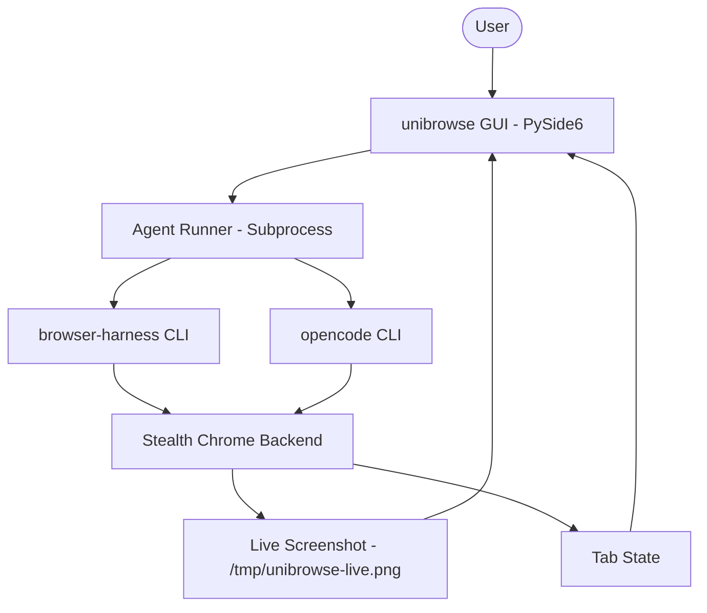

# unibrowse Architecture

This document describes the high-level architecture of **unibrowse**, a dock-launchable macOS frontend for stealth browser automation.

## System Overview

unibrowse acts as a bridge between the user and powerful automation engines like `browser-harness` and `opencode`. It provides a graphical interface for real-time observation and control while maintaining a stealthy, non-disruptive browser environment.

## Core Components

### 1. Frontend (PySide6) - `app.py`
The main application entry point. It manages:
- **Activity Feed:** A terminal-like display for agent actions and reasoning.
- **Live Observation:** Real-time screenshot polling and tab management.
- **Input Controls:** Natural language task entry or raw Python code execution.
- **Session Modes:** Switching between Agent, Personal, and Remote CDP backends.

### 2. Profile Management - `migrate.py`
Handles the isolation of browser data:
- **Migration:** Syncs a copy of the user's personal Chrome profile to a dedicated agent profile to preserve cookies/sessions without risking the main profile.
- **Isolation:** Uses rsync with exclusions (locks, caches, sockets) to ensure the agent profile can run independently.
- **Remote Sync:** Provides hooks to push local profiles to remote Linux backends.

### 3. Browser Backend - `browser-harness` & `opencode`
The underlying engines that provide automation and execution.
- **browser-harness:** Provides the CDP bridge and stealth window management (`BH_NO_ACTIVATE=1`).
- **opencode:** The foundational agent runtime and execution environment.

## Data Flow

1.  **Task Initiation:** The user enters a task in the GUI.
2.  **Prompt Construction:** `app.py` builds a rich prompt including global instructions, user preferences (`user_card.md`), and the current browser state.
3.  **Execution:** The GUI spawns a subprocess running `unibrowse-run` or `browser-harness`.
4.  **Observation Loop:** In parallel, the GUI polls the browser for screenshots and tab updates, refreshing the UI every 3 seconds during active tasks.
5.  **Reflection:** Upon completion, a background "reflection" module runs to store learnings or cleanup browser state.

## Security & Persistence

- **Keychain:** Sensitive credentials are stored in the macOS Keychain under the `unibrowse:` service.
- **Workspace:** The `browser-harness/agent-workspace` directory holds persistent agent prompts and the user profile card.
